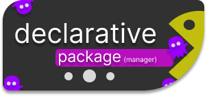

<h1 align="center">decpkg</h1>

<table align="center">
  <tr>
    <td></td>
    <td>
      <strong>decpkg</strong> — <a href="https://www.python.org/">python</a> script<br/>
      allows you to manage packages  <br/>
      declarative images following the. <br/>
      declarative programming paradigm.<br/>
    </td>
  </tr>
</table>

#### links

[~> Example](#example) <br />
[~> Dependencies](#Dependencies) <br />
[~> Install](#Dependencies) <br />

---

## Dependencies

`python` — to start the interpreter <br />
`pyinstaller`— to create a binary file for better speed <br />

## Example

#### Ability to create a configuration directory and generate configs

https://github.com/user-attachments/assets/524b5196-dd3c-4f06-93d4-de58ad5b6020

> I opened the terminal and then ran `decpkg -g` to generate the configuration file.  
> After that, a prompt appeared asking for confirmation with a `y/n` choice. This prompt  
> appears if a configuration file already exists, and it asks whether to overwrite the  
> existing configuration. I pressed `n` to avoid overwriting the config.  
> Next, I opened the file manager [yazi](https://github.com/sxyazi/yazi) and navigated to the path  
> `~/.config/declarative_package/`.  
> There, I opened `config.jsonc`, and now I can edit the configuration file.  
> You can see an example in the video.

### Synchronization of current packages installation and uninstallation

#### Absolute Synchronization

https://github.com/user-attachments/assets/79f1afd8-f6ff-4694-b386-93250556e8a5

> **Note:** _Absolute_ mode is enabled, which means absolute synchronization.  
> During synchronization, all currently installed packages from the official  
> repositories (`pacman`) and the AUR are recorded into a `.history.json` file  
> located in the configuration directory. This list is stored as the _current state base_.  
> If during the next synchronization a package is **missing** from the configuration file  
> but **present** in the base, it will be **removed** from the system.  
> This enforces strict alignment between the system and the declared configuration.

#### Relative Synchronization

> **Note:** _Relative_ synchronization mode is also available.  
> In this mode, packages defined in the configuration will be **installed**,  
> but **removal** of packages must be done manually using standard tools,  
> such as `pacman -Rns <package>`.  
> This mode offers a more flexible and familiar workflow for users who prefer  
> to handle uninstalls themselves.

#### Ability to install paru or yay to work with arch user repositories

##### `decpkg -a`

> The `-a` flag allows you to select which AUR helper to use for installing packages.  
> You can choose between `paru` or `yay`, depending on your preference or system setup.  
> This makes it easy to manage AUR packages with your preferred tool.

#### Define your preferred AUR helper in the configuration file

##### `"aur_helper": "paru",`

> You can set your favorite AUR helper directly in the configuration file.  
> Once defined, all AUR-related installations will use the following pattern:  
> `<aur helper> -Sa <package>` — ensuring that packages are installed strictly from the AUR.  
> This gives you full control over which tool handles your AUR operations.

#### Ability to define superuser access method in the configuration file

##### example: `"use_root"  : "sudo",`

> In the configuration file, you can specify which tool should be used to gain superuser access —  
> either `sudo` or `doas`.  
> This setting ensures compatibility with your system’s preferred privilege escalation method.

#### More configuration options

> More detailed configuration options are defined directly in the config file itself.  
> You can explore all available fields and examples by opening the configuration file:  
> [config.jsonc](example.jsonc)

## Install

##### AUR

```bash
<helper> -S decpkg
```

##### Manual

```
git clone https://maarutan/decpkg.git ~/decpkg.git
cd ~/decpkg.git
makepkg -si
```

## License

This project is licensed under the [MIT License](License)
You are free to use, modify, and distribute this software with proper attribution.
